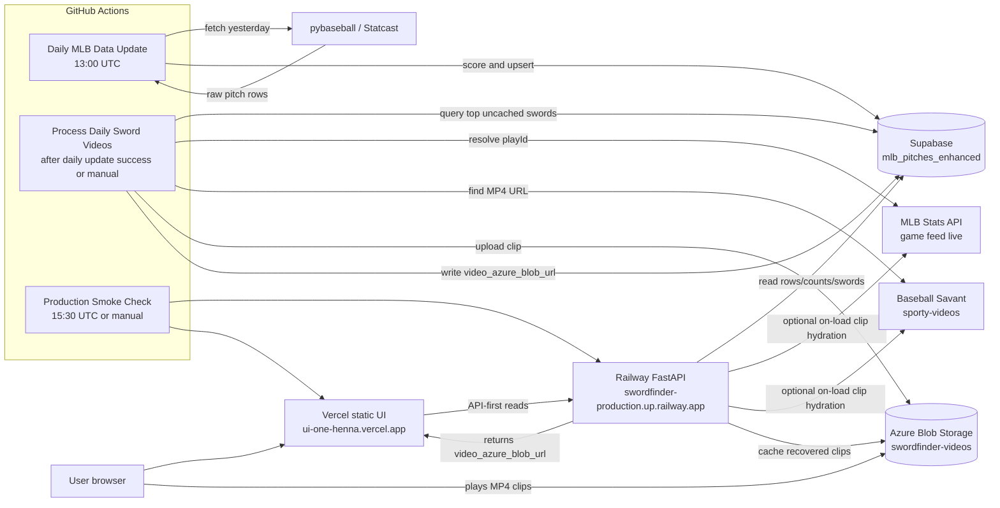
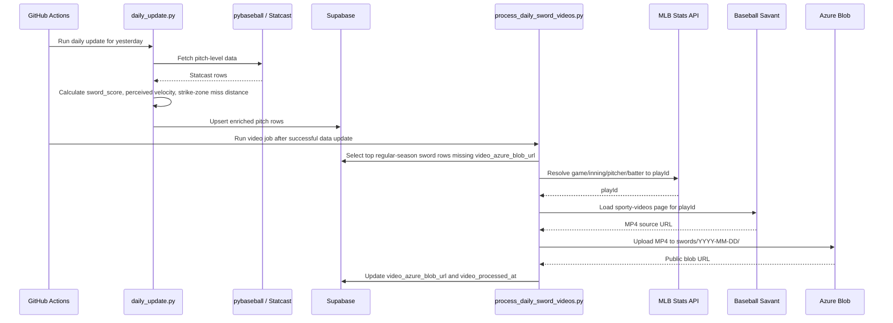
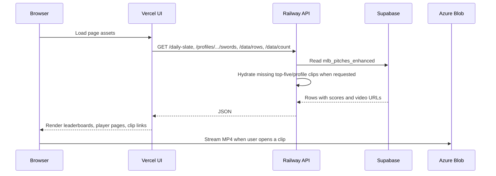
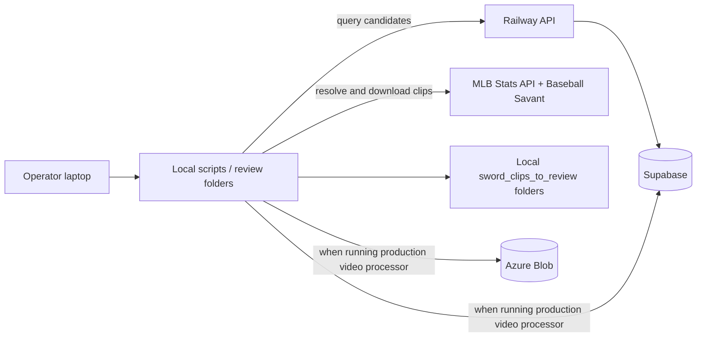

# SwordFinder Architecture

SwordFinder has two main paths:

- **Read path:** the browser reads ranked sword data through the Railway API.
- **Write path:** GitHub Actions jobs fetch Statcast data, score candidates, resolve MLB clips, upload clips to Azure, and update Supabase.

## Production Topology



## Nightly Data Flow



## Request Flow



## Important Boundaries

- **Supabase is the source of truth** for pitch rows, rankings, score fields, and cached video URLs.
- **Azure is only the clip cache.** Missing `video_azure_blob_url` does not mean MLB has no video; it means SwordFinder has not cached that clip yet or a resolver/upload step failed.
- **Railway is the API boundary** for production browser reads. Direct Supabase reads in the UI are fallback-only.
- **Vercel is static UI hosting.** It should not hold secrets or talk to Supabase with service-role credentials.
- **The Ops UI is read-only.** It reads Railway health, video backlog status, and season counts; it does not trigger video processing yet.
- **GitHub Actions owns scheduled writes.** The daily update writes data; the video workflow writes video URLs; the smoke workflow only verifies production.
- **The first video backlog is virtual.** A sword row with `sword_score > 0` and no `video_azure_blob_url` is treated as a pending video job. This avoids a new table while giving the app a real backlog surface.
- **On-load hydration is capped.** The homepage hydrates only the selected top five; profile pages hydrate visible missing profile clips up to `PROFILE_VIDEO_HYDRATION_MAX` so a profile view cannot drain a whole season by accident.

## Video Resolution Details

The video processor uses this chain:

1. Read top uncached sword candidates from Supabase.
2. Match each row to the MLB game feed by `game_pk`, `pitcher`, `batter`, `inning`, and `inning_topbot`.
3. Resolve the matching play event to a `playId`.
4. Load Baseball Savant `sporty-videos?playId=...`.
5. Extract the MP4 source.
6. Upload the MP4 to Azure Blob Storage.
7. Patch Supabase with `video_azure_blob_url`.

The play-id resolver normalizes half-inning labels because the database stores values such as `Top` and `Bot`, while MLB feed values are `top` and `bottom`.

## Video Backlog Controls

The backlog is exposed through read-only API endpoints:

- `GET /ops/video-backlog/status`
- `GET /ops/video-backlog/status?date=YYYY-MM-DD`
- `GET /ops/video-backlog?date=YYYY-MM-DD&limit=50`

The video worker still defaults to a conservative top-10 daily run, but it can now drain larger slices on demand:

```bash
python process_daily_sword_videos.py --date 2026-05-03 --top-n 25
python process_daily_sword_videos.py --date 2026-05-03 --all
```

The GitHub workflow keeps the default behavior. Manual/local runs can use `--date`, `--top-n`, `--all`, `VIDEO_TOP_N`, or `VIDEO_PROCESS_ALL=true`.

## Local Review / Backfill Path



The local review folders are for human inspection. Production state changes only happen when a script uploads to Azure and writes the resulting URL back to Supabase.
