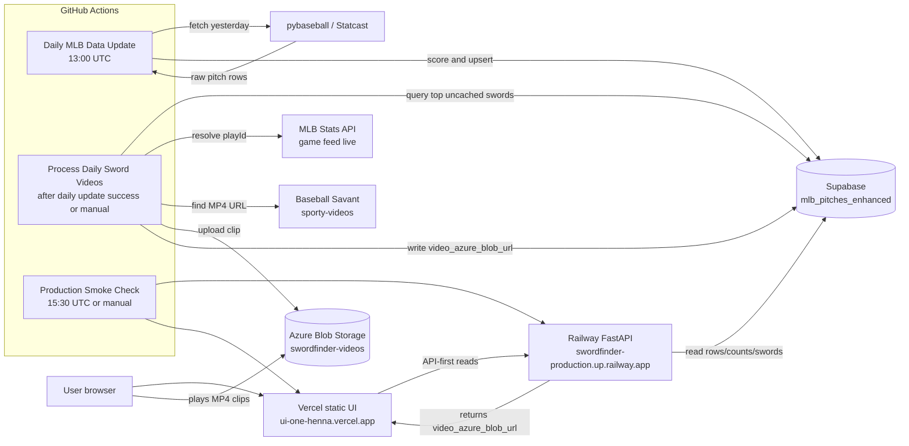
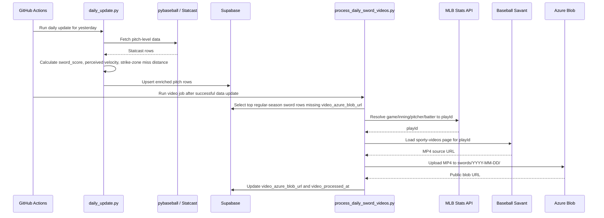
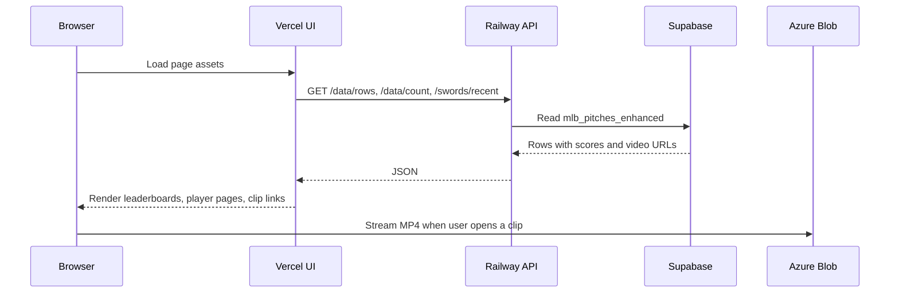
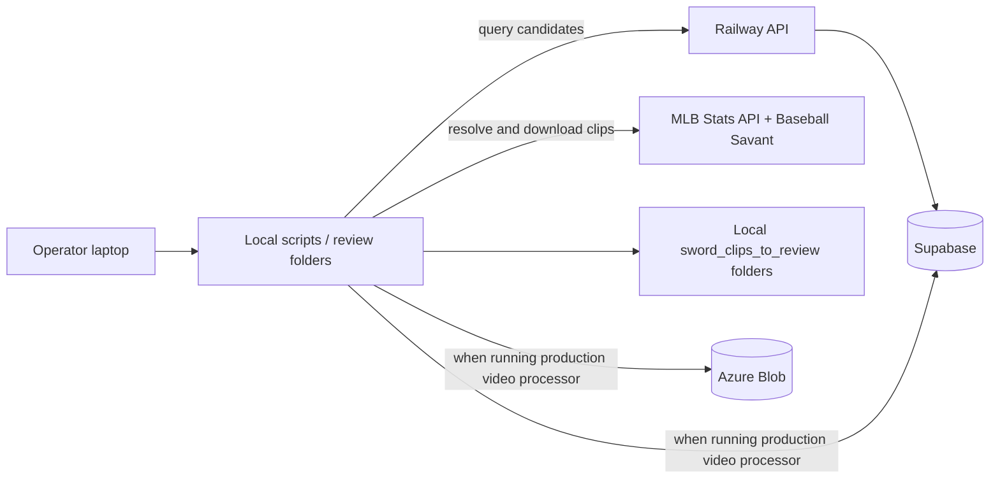

# SwordFinder Architecture

SwordFinder has two main paths:

- **Read path:** the browser reads ranked sword data through the Railway API.
- **Write path:** GitHub Actions jobs fetch Statcast data, score candidates, resolve MLB clips, upload clips to Azure, and update Supabase.

## Production Topology

## Nightly Data Flow

## Request Flow

## Important Boundaries

- **Supabase is the source of truth** for pitch rows, rankings, score fields, and cached video URLs.
- **Azure is only the clip cache.** Missing `video_azure_blob_url` does not mean MLB has no video; it means SwordFinder has not cached that clip yet or a resolver/upload step failed.
- **Railway is the API boundary** for production browser reads. Direct Supabase reads in the UI are fallback-only.
- **Vercel is static UI hosting.** It should not hold secrets or talk to Supabase with service-role credentials.
- **GitHub Actions owns scheduled writes.** The daily update writes data; the video workflow writes video URLs; the smoke workflow only verifies production.

## Video Resolution Details

The video processor uses this chain:

1. Read top uncached sword candidates from Supabase.
2. Match each row to the MLB game feed by `game_pk`, `pitcher`, `batter`, `inning`, and `inning_topbot`.
3. Resolve the matching play event to a `playId`.
4. Load Baseball Savant `sporty-videos?playId=...`.
5. Extract the MP4 source.
6. Upload the MP4 to Azure Blob Storage.
7. Patch Supabase with `video_azure_blob_url`.

The play-id resolver normalizes half-inning labels because the database stores values such as `Top` and `Bot`, while MLB feed values are `top` and `bottom`.

## Local Review / Backfill Path

The local review folders are for human inspection. Production state changes only happen when a script uploads to Azure and writes the resulting URL back to Supabase.
