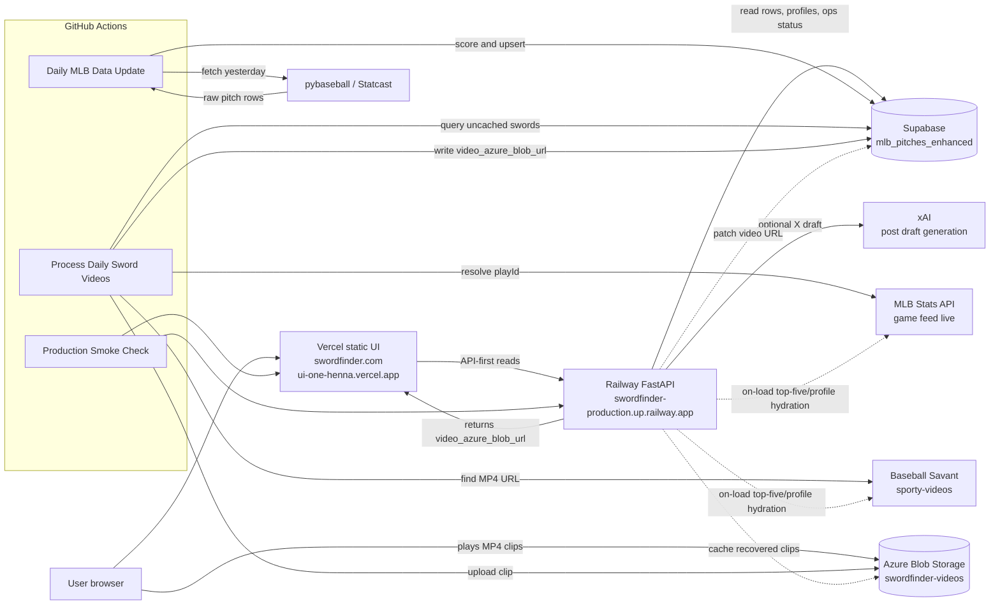

# SwordFinder

SwordFinder finds "sword" swings in MLB Statcast data: awkward two-strike swinging strikes with bad bat speed, ugly miss distance, and enough pitch context to rank, watch, and share the day's best whiffs.

## Current Production Shape

- Public UI: `https://swordfinder.com`
- Vercel fallback URL: `https://ui-one-henna.vercel.app`
- Ops UI: `https://swordfinder.com/ops`
- FastAPI backend: `https://swordfinder-production.up.railway.app`
- Database: Supabase table `mlb_pitches_enhanced`
- Video storage: Azure Blob container `swordfinder-videos`
- Automation: GitHub Actions on `main`

The V1 homepage is data-driven: the user selects a date, the app loads the top five sword swings for that date, and the API tries to cache any missing top-five clips before the page renders. Leaderboards link into hitter and pitcher profiles, and those profile pages now use a hydrating profile API instead of read-only Supabase row queries.

## Architecture



## API Surface

Production browser reads go through Railway by default:

- `GET /health`
- `GET /data/rows`
- `GET /data/count`
- `GET /daily-slate?date=YYYY-MM-DD&limit=5&ensure_videos=true`
- `GET /profiles/pitcher/{pitcher_id}/swords?start_date=YYYY-MM-DD&end_date=YYYY-MM-DD&ensure_videos=true`
- `GET /profiles/batter/{batter_id}/swords?start_date=YYYY-MM-DD&end_date=YYYY-MM-DD&ensure_videos=true`
- `GET /swords/recent`
- `GET /ops/video-backlog/status`
- `GET /ops/video-backlog`
- `POST /share/x/draft`

Direct browser reads from Supabase are fallback-only when `apiBaseUrl` is unset in `ui/assets/config.js`.

## Video Hydration

Missing `video_azure_blob_url` means SwordFinder has not cached the MLB clip yet, not necessarily that the clip does not exist.

Public SwordFinder surfaces use a hard sword floor of `sword_score >= 90.0`. Rows below 90 can stay in Supabase for analysis, but they should not appear in the public UI, leaderboards, profile histories, ops counts, or video backlog.

The main video paths are:

- Scheduled: `Process Daily Sword Videos` runs from GitHub Actions after the daily Statcast update.
- Homepage fallback: `/daily-slate` tries to hydrate missing top-five clips for the selected date.
- Profile fallback: `/profiles/.../swords` tries to hydrate missing visible profile clips, capped by `PROFILE_VIDEO_HYDRATION_MAX` with a default of `12`.
- Manual: local scripts can drain a date or broader backlog on demand.

Video resolution chain:

1. Query uncached sword candidates from Supabase.
2. Match each row to the MLB game feed by `game_pk`, `pitcher`, `batter`, `inning`, and `inning_topbot`.
3. Resolve the matching play event to a `playId`.
4. Load Baseball Savant `sporty-videos?playId=...`.
5. Extract the MP4 source.
6. Upload the MP4 to Azure Blob Storage.
7. Patch Supabase with `video_azure_blob_url` and `video_processed_at`.

## Important Data Model Note

Raw Statcast rows use `player_name` as the pitcher name. SwordFinder UI and legacy sword endpoints should present swords from the hitter perspective:

- `batter` / `batter_name`: hitter who swung
- `pitcher` / `pitcher_name`: pitcher who induced the miss
- `player_name`: normalized to the hitter name in SwordFinder API responses
- `source_player_name`: original raw Statcast `player_name`

When adding UI or API functionality, prefer `batter_name` for hitters and `pitcher_name` for pitchers.

## Local Setup

```bash
cd /Users/joewilson/pythonprojects/swordfinder/SwordFinder
python3 -m venv .venv
source .venv/bin/activate
pip install -r requirements.txt
```

Secrets should come from local environment files, not source control. On this machine:

```bash
source ~/.luna/secrets/keys.env
```

## Run Locally

API:

```bash
source .venv/bin/activate
uvicorn api:app --reload --port 8000
```

UI:

```bash
cd ui
python3 -m http.server 3000
```

Open:

- `http://localhost:3000/index.html`
- `http://localhost:3000/leaderboards.html`
- `http://localhost:3000/player/[id].html?id=608369`
- `http://localhost:3000/pitcher/[id].html?id=571578`
- `http://localhost:3000/ops.html`

## Daily Operations

GitHub Actions:

- `Daily MLB Data Update`: fetches yesterday's Statcast data, calculates sword scores, and updates Supabase.
- `Process Daily Sword Videos`: runs after the daily data workflow succeeds, then attempts videos for top uncached sword swings at the public 90+ floor.
- `Production Smoke Check`: checks Railway API health, live data, recent swords, and core Vercel routes.

Useful local checks:

```bash
PYTHONPATH=. .venv/bin/pytest -q
python test_workflow_imports.py
curl -fsS https://swordfinder-production.up.railway.app/health
curl -fsS "https://swordfinder-production.up.railway.app/daily-slate?date=2026-05-06&limit=5&ensure_videos=true"
curl -fsS "https://swordfinder-production.up.railway.app/profiles/pitcher/571578/swords?start_date=2026-01-01&end_date=2027-01-01&limit=80&ensure_videos=true"
curl -fsS "https://swordfinder-production.up.railway.app/ops/video-backlog/status?date=2026-05-06"
```

Manual video backlog runs:

```bash
source ~/.luna/secrets/keys.env
python process_daily_sword_videos.py --date 2026-05-06 --top-n 25
python process_daily_sword_videos.py --date 2026-05-06 --all
python process_season_video_backlog.py --min-score 90 --batch-size 10
```

Daily homepage slate backfill:

```bash
source ~/.luna/secrets/keys.env
python backfill_daily_slate_videos.py --start-date 2026-03-25 --end-date 2026-05-07 --limit 5 --dry-run
python backfill_daily_slate_videos.py --start-date 2026-03-25 --end-date 2026-05-07 --limit 5
```

## Deploy

Backend:

```bash
railway up --service swordfinder --environment production --detach
```

UI:

```bash
VERCEL_ORG_ID=team_obaWAGPt4oUP8fqvo5zVlBsx VERCEL_PROJECT_ID=prj_mCWq6JWufw70bB7xA7mlU6Lo4rjy vercel deploy --prod --yes
```

## Key Files

- `api.py`: FastAPI backend, API-first UI reads, daily slate/profile hydration, ops endpoints, and xAI draft endpoint.
- `daily_update.py`: daily Statcast ingestion and scoring.
- `process_daily_sword_videos.py`: video processing workflow target.
- `process_season_video_backlog.py`: manual 90+ season video backlog drain.
- `backfill_daily_slate_videos.py`: date-range top-five video backfill helper.
- `ui/`: static Vercel frontend.
- `.github/workflows/`: scheduled/manual automation.
- `ARCHITECTURE.md`: expanded architecture notes and sequence diagrams.
- `PROGRESS_2026.md`, `DECISIONS_2026.md`, `FINAL_REPORT_2026.md`: revival notes and operating decisions.

## Next Functional Work

The production path is stable enough for V1. The next useful functionality should stay narrow:

- Make search/player lookup easier from the main UI.
- Add a small retry control for pending clips in Ops.
- Add richer pitcher/hitter profile stats once the top-five daily experience is polished.
