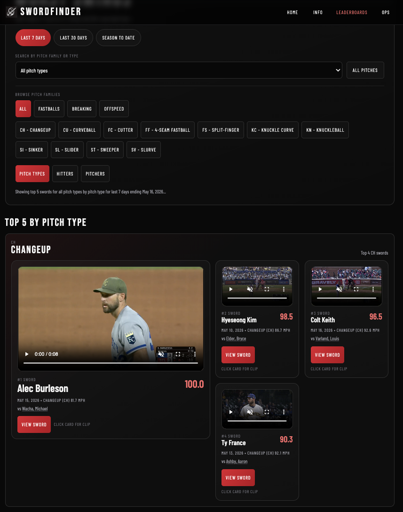
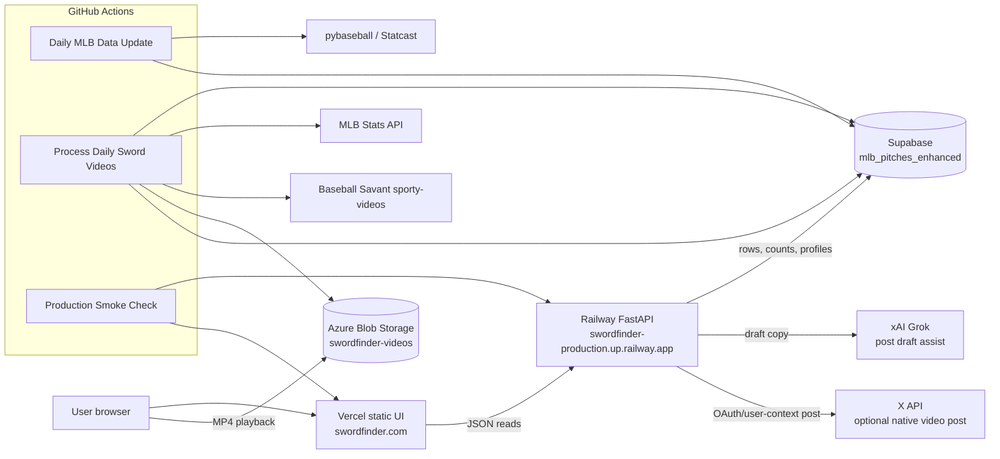

<div align="center">

# SwordFinder

**A live MLB data product for finding, scoring, watching, and sharing the ugliest strikeout swings in baseball.**

SwordFinder ranks "swords": two-strike swinging-strike moments where the hitter is so fooled that the bat dies out front. The site combines Statcast-derived pitch data, bat-tracking fields, a proprietary SwordFinder Score, cached MLB video clips, and shareable leaderboard views.

[](https://swordfinder.com)
[](https://swordfinder.com/ops)
[](#stack)
[](#verification)

[Try it](https://swordfinder.com) · [Ops diagram](https://swordfinder.com/ops) · [Sword info](https://swordfinder.com/sword-info.html)

<br />



</div>

---

## Why it exists

Baseball fans already know a sword when they see one: the swing is late, awkward, and over before the bat finishes. SwordFinder turns that baseball-internet moment into a ranked product:

- Which hitter got fooled the worst today?
- Which pitch type produces the nastiest swords?
- Which pitchers are inducing the most ugly strikeout swings?
- Which hitters are getting slain most often?

The important product rule is **No K, no sword**. A hitter can look terrible on pitch two and still win the at-bat on pitch three. SwordFinder focuses on the finished strikeout moment, because that is the clip people remember.

## Current Features

- **Daily sword slate** with date picker, top-five rankings, score metrics, and video-ready counts.
- **Pitch-type explorer** for season leaderboards by family or individual pitch type, such as fastballs, sliders, sinkers, cutters, and changeups.
- **Leaderboard views** for pitch types, hitter sword leaders, and pitcher sword leaders.
- **Shareable sword detail pages** at `/sword/{id}` with video, score breakdown, copy link, native share, and X intent.
- **Hitter and pitcher profiles** with historical sword rows and profile-specific clip hydration.
- **Sword Info page** with the term explainer, embedded source videos, and replayable first-visit onboarding.
- **Ops dashboard** with Railway API health, Supabase/Azure/GitHub/Vercel architecture, video backlog status, and run commands.
- **X sharing support** for operator-gated post drafts and optional native video upload.

## How It Works

1. **GitHub Actions runs the daily data job** after MLB games are complete.
2. **`daily_update.py` pulls Statcast data** through `pybaseball`, enriches pitch rows, calculates miss distance and SwordFinder Score, and upserts to Supabase.
3. **The video workflow resolves top swords** through MLB Stats API and Baseball Savant, uploads clips to Azure Blob Storage, and writes `video_azure_blob_url` back to Supabase.
4. **Railway FastAPI serves the public API** for daily slates, profile rows, generic data reads, share workflows, and ops status.
5. **Vercel hosts the static UI** at `swordfinder.com`.
6. **The browser streams clips directly from Azure** and renders leaderboards, profile pages, share pages, and ops views.

## Architecture



The fuller system diagram and operational notes live on the public [Ops page](https://swordfinder.com/ops).

## Stack

- **Frontend:** static HTML, vanilla JavaScript modules, Tailwind CDN, custom CSS
- **Hosting:** Vercel static deployment from `ui/`
- **API:** FastAPI on Railway
- **Database:** Supabase Postgres, centered on `mlb_pitches_enhanced`
- **Video cache:** Azure Blob Storage
- **Data pipeline:** Python, `pybaseball`, MLB Stats API, Baseball Savant video resolution
- **Automation:** GitHub Actions for data update, video processing, and production smoke checks
- **Social/AI:** xAI Grok for optional copy drafting; X API for authenticated native video posting

## Key Routes

| Route | Purpose |
| --- | --- |
| [`/`](https://swordfinder.com) | Daily top-five sword slate |
| [`/leaderboards`](https://swordfinder.com/leaderboards) | Pitch-type, hitter, and pitcher leaderboards |
| [`/leaderboards?range=season&pitch_type=FF`](https://swordfinder.com/leaderboards?range=season&pitch_type=FF) | Example pitch-type board |
| [`/sword-info`](https://swordfinder.com/sword-info) | Explainer, source clips, onboarding replay |
| [`/ops`](https://swordfinder.com/ops) | Production health, backlog, architecture |
| `/sword/{id}` | Shareable sword detail page |
| `/player/{id}` | Hitter sword profile |
| `/pitcher/{id}` | Pitcher sword-inducer profile |

## API Surface

The frontend primarily reads through Railway:

- `GET /daily-slate`
- `GET /data/rows`
- `GET /data/count`
- `GET /profiles/{profile_kind}/{entity_id}/swords`
- `GET /ops/video-backlog/status`
- `GET /ops/video-backlog`
- `GET /health`
- `GET /swords/recent`
- `POST /share/x/draft`
- `POST /share/x/post`
- `POST /share/x/top-sword`

Operator-gated endpoints use `SWORDFINDER_ADMIN_TOKEN`. Public share flows have a non-AI fallback.

## Run Locally

### API

```bash
python3 -m venv .venv
source .venv/bin/activate
pip install -r requirements.txt
uvicorn api:app --reload --host 0.0.0.0 --port 8000
```

Required secrets are loaded from environment variables. On this machine, local keys are kept outside the repo in `~/.luna/secrets/keys.env`.

### UI

```bash
cd ui
python3 -m http.server 3000
```

Open `http://localhost:3000/index.html`.

Runtime config lives in [`ui/assets/config.js`](ui/assets/config.js). By default, the local static UI reads from the production Railway API unless `window.SWORDFINDER_CONFIG` is overridden.

## Scheduled Jobs

| Workflow | Purpose |
| --- | --- |
| `.github/workflows/daily-update.yml` | Pulls yesterday's MLB data, scores sword candidates, writes Supabase rows |
| `.github/workflows/process-daily-videos.yml` | Runs after the data job, resolves top clips, uploads to Azure |
| `.github/workflows/production-smoke.yml` | Checks Railway health, live data, recent swords, video backlog, and core UI routes |

See [`.github/workflows/README.md`](.github/workflows/README.md) for the workflow inventory and required secrets.

## Verification

Current local verification:

```bash
PYTHONPATH=. .venv/bin/pytest -q
node --check ui/assets/index.js
node --check ui/assets/leaderboards.js
node --check ui/assets/supabase-rest.js
git diff --check
```

The current suite has **88 passing tests**. Recent production smoke checks also covered desktop and WebKit mobile viewports for the homepage, pitch-type boards, hitter/pitcher leaderboards, sword pages, video previews, and horizontal-overflow regressions.

## Portfolio Notes

SwordFinder is useful as an end-to-end AI-assisted engineering case study:

- messy sports/data idea to live public product
- custom scoring model and domain-specific product rules
- data pipeline plus video pipeline
- API boundary, static frontend, and cloud deployment
- production smoke testing and mobile/WebKit verification
- shareable artifacts for a real audience

It is intentionally framed as a working product/proof, not a finished media company.

## License

MIT for the project code. MLB/Statcast data and MLB video rights belong to their respective owners.
