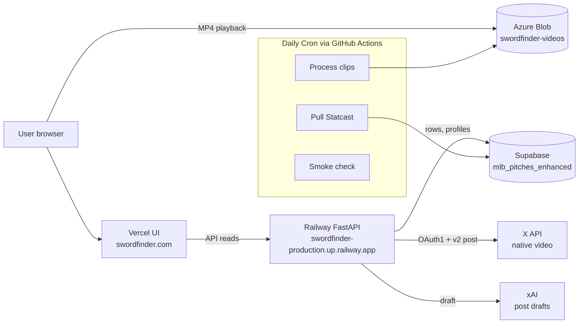

# ⚔️ SwordFinder

**Find the day's most embarrassing swings in MLB.**

SwordFinder surfaces "sword" swings — awkward two-strike whiffs with bad bat speed, ugly miss distance, and enough pitch context to rank, watch, and share the worst whiffs of the day.

[**🔗 Try it →**](https://swordfinder.com)

---

## What it does

Every morning at dawn, SwordFinder:

1. **Pulls yesterday's Statcast data** via `pybaseball` (every pitch, every swing)
2. **Scores every two-strike whiff** on a composite "sword index" (bat speed delta, miss distance, swing context, situational stakes)
3. **Surfaces the top 5** with video clips from Baseball Savant
4. **Posts the worst one** to [@swordfinderbot](https://x.com/swordfinderbot) with an xAI-drafted caption

Visit `swordfinder.com`, pick a date, watch the worst hacks in baseball.

## Features

- 📅 **Date-picker UI** — see the worst whiffs of any past day
- 🏟️ **Hitter + pitcher profile pages** — career sword leaderboards, hydrating profile API
- 🎥 **Embedded video clips** — straight from Baseball Savant's `sporty-videos` feed
- 🤖 **Auto-posting bot** — daily X/Twitter posts with native video upload
- ⚙️ **Ops dashboard** at `/ops` — pipeline health, error feed, manual trigger

## Architecture

## Stack

- **UI:** Next.js (App Router) + TypeScript + Tailwind — deployed on **Vercel**
- **API:** FastAPI (Python) — deployed on **Railway**
- **Data:** Supabase Postgres (`mlb_pitches_enhanced` table)
- **Video:** Azure Blob Storage (`swordfinder-videos` container)
- **Pipeline:** GitHub Actions cron (daily MLB pull, video processing, smoke checks)
- **AI:** xAI Grok for post drafts
- **Social:** X API v2 with OAuth1 native-video upload

## Run locally

This is a production product, not a starter template — but if you want to fork and run your own version, the major moving parts are:

- `daily-update.yml` — fetches yesterday's Statcast and upserts pitch rows
- `process-daily-videos.yml` — pulls clips for top-N swings into Azure Blob
- `api/` — FastAPI service with `/picks`, `/profile/<player>`, `/ops/*` endpoints
- `ui/` — Next.js front-end

See `.github/workflows/` for the daily orchestration.

## License

MIT — but the Statcast data is MLB's, not mine.
